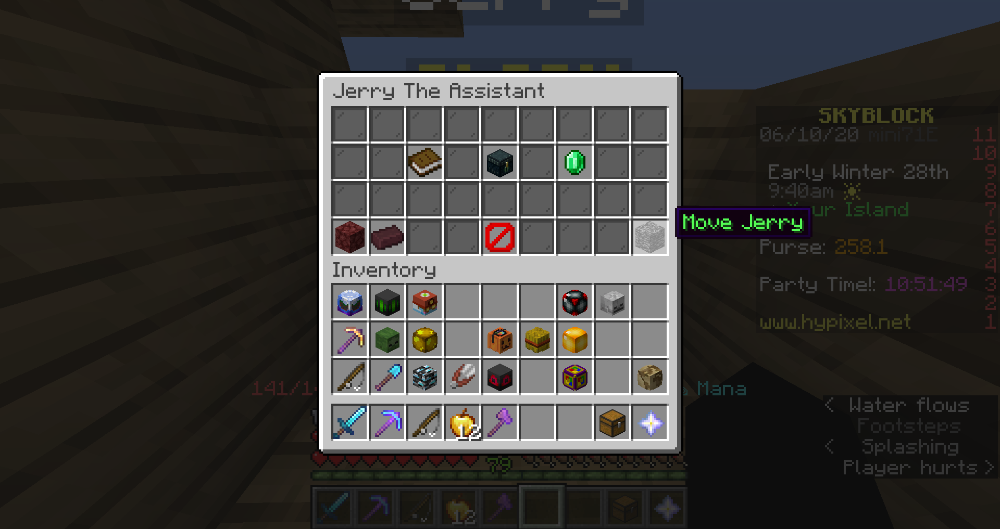

# SkyBlockJerryEggMiner

An AFK auto-clicker for Minecraft Hypixel SkyBlock.

SkyBlock has a new NPC named "Jerry", and his egg can be farmed.

This tool will automatiacally farm it.

Instructions: 
============

Download the script.

Set up a contraption like this:

Make sure player is looking at Jerry, can drop eggs into hopper, has "Drop Item" keybind changed to left click, UI size normal, and is selecting the first open slot in their hotbar.
Run the script. You will have a 10 second delay to get into Minecraft and face Jerry. Ensure that Minecraft is unpaused.

If it dosen't press the "Move Jerry" button, try changing the buttonprecentx and buttonprecenty values.

Dependencies
============

Python 2-3

PyAutoGui "pip install pyautogui"
